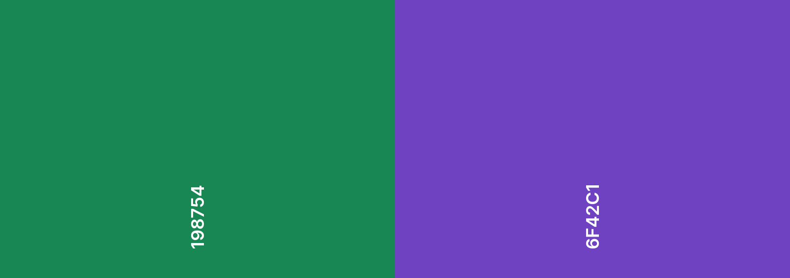

# UNISEEK - Seek Your Destination

Access demo site [here](https://josezhz.github.io/project-1/)

## Overview

UNISEEK is a web application that helps visualize the locations and ranking scores of the world's top 50 universities through interactive map and charts.

### Users' Goals

Users of UNISEEK such as pre-university (pre-U) graduates aim to have a better visual understanding of the world's top universities in terms of locations, ranking scores and rankings by different subject areas.

### Organization's Goals

The goal of UNISEEK is to provide pre-U graduates who are still undecided about their destination for university education with a platform explore and make a more informed decision.

---

## UI/UX

### User Stories & Acceptance Criteria

User Stories | Acceptance Criteria
--- | ---
As a pre-U graduate who wants to pursue a degree in medicine in the United States, I would like to know what are the good universities for medicine in the United States and where they are located. | A map application that is able to show locations of top universities for medicine in the United States.
As a pre-U graduate interested in studying natural sciences in university but still unsure of which universities are good for pursuing a degree in natural sciences, I would like to have a general overview of the world's top universities for natural sciences, and for each university, how it scores in terms of academic and employer reputation. | A world's top universities ranking table that allows me to specify the type of ranking by subject with charts showing each university's score by different indicators such as academic and employer repuation.

### Color



Green and purple are the theme colors of this website.

Green is the main color used in the map page. It represents hope and symbolizes pre-U graduates' hope for styding in a top university of their desired location and subject.

Purple is the main color useed in the chart page. It represents wisdom and symbolizes universities as the place for intellectual 


```markdown
Syntax highlighted code block

# Header 1
## Header 2
### Header 3

- Bulleted
- List

1. Numbered
2. List

**Bold** and _Italic_ and `Code` text

[Link](url) and 
```

For more details see [Basic writing and formatting syntax](https://docs.github.com/en/github/writing-on-github/getting-started-with-writing-and-formatting-on-github/basic-writing-and-formatting-syntax).

### Jekyll Themes

Your Pages site will use the layout and styles from the Jekyll theme you have selected in your [repository settings](https://github.com/josezhz/project-1/settings/pages). The name of this theme is saved in the Jekyll `_config.yml` configuration file.

### Support or Contact

Having trouble with Pages? Check out our [documentation](https://docs.github.com/categories/github-pages-basics/) or [contact support](https://support.github.com/contact) and we’ll help you sort it out.
